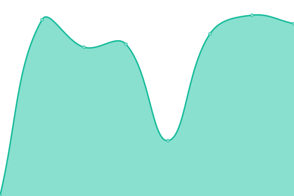

# [📈 Live Status](https://downclash.github.io/web_monitor): <!--live status--> **🟩 All systems operational**

This repository contains the open-source uptime monitor and status page for [clashworld](https://downclash.github.io/web_monitor), powered by [Upptime](https://github.com/upptime/upptime).

With [Upptime](https://upptime.js.org), you can get your own unlimited and free uptime monitor and status page, powered entirely by a GitHub repository. We use [Issues](https://github.com/downclash/web_monitor/issues) as incident reports, [Actions](https://github.com/downclash/web_monitor/actions) as uptime monitors, and [Pages](https://downclash.github.io/web_monitor) for the status page.

<!--start: status pages-->
<!-- This summary is generated by Upptime (https://github.com/upptime/upptime) -->
<!-- Do not edit this manually, your changes will be overwritten -->
<!-- prettier-ignore -->
| URL | Status | History | Response Time | Uptime |
| --- | ------ | ------- | ------------- | ------ |
|  [clashxhub.com](https://clashxhub.com) | 🟩 Up | [clashxhub-com.yml](https://github.com/downclash/web_monitor/commits/HEAD/history/clashxhub-com.yml) | 

 201ms
     
 | 

<a href="https://downclash.github.io/web_monitor/history/clashxhub-com">100.00%</a>
    

|  [clashkit.com](https://clashkit.com) | 🟩 Up | [clashkit-com.yml](https://github.com/downclash/web_monitor/commits/HEAD/history/clashkit-com.yml) | 

 232ms
     
 | 

<a href="https://downclash.github.io/web_monitor/history/clashkit-com">100.00%</a>
    

|  [clash4mac.com](https://clash4mac.com) | 🟩 Up | [clash4mac-com.yml](https://github.com/downclash/web_monitor/commits/HEAD/history/clash4mac-com.yml) | 

 376ms
     
 | 

<a href="https://downclash.github.io/web_monitor/history/clash4mac-com">0.00%</a>
    

|  [clash4android.com](https://clash4android.com) | 🟩 Up | [clash4android-com.yml](https://github.com/downclash/web_monitor/commits/HEAD/history/clash4android-com.yml) | 

 360ms
     
 | 

<a href="https://downclash.github.io/web_monitor/history/clash4android-com">100.00%</a>
    

|  [clash4windows.com](https://clash4windows.com) | 🟩 Up | [clash4windows-com.yml](https://github.com/downclash/web_monitor/commits/HEAD/history/clash4windows-com.yml) | 

 348ms
     
 | 

<a href="https://downclash.github.io/web_monitor/history/clash4windows-com">100.00%</a>
    

|  [v2rayn.co](https://v2rayn.co) | 🟩 Up | [v2rayn-co.yml](https://github.com/downclash/web_monitor/commits/HEAD/history/v2rayn-co.yml) | 

 505ms
     
 | 

<a href="https://downclash.github.io/web_monitor/history/v2rayn-co">100.00%</a>
    

|  [v2rayu.co](https://v2rayu.co) | 🟩 Up | [v2rayu-co.yml](https://github.com/downclash/web_monitor/commits/HEAD/history/v2rayu-co.yml) | 

 487ms
     
 | 

<a href="https://downclash.github.io/web_monitor/history/v2rayu-co">100.00%</a>
    

|  [v2rayng.co](https://v2rayng.co) | 🟩 Up | [v2rayng-co.yml](https://github.com/downclash/web_monitor/commits/HEAD/history/v2rayng-co.yml) | 

 526ms
     
 | 

<a href="https://downclash.github.io/web_monitor/history/v2rayng-co">100.00%</a>
    

|  [justmysockss.org](https://justmysockss.org) | 🟩 Up | [justmysockss-org.yml](https://github.com/downclash/web_monitor/commits/HEAD/history/justmysockss-org.yml) | 

 1136ms
     
 | 

<a href="https://downclash.github.io/web_monitor/history/justmysockss-org">100.00%</a>
    

|  [v2ray-x.com](https://v2ray-x.com) | 🟩 Up | [v2ray-x-com.yml](https://github.com/downclash/web_monitor/commits/HEAD/history/v2ray-x-com.yml) | 

 1113ms
     
 | 

<a href="https://downclash.github.io/web_monitor/history/v2ray-x-com">100.00%</a>
    

|  [tizidaquan.com](https://tizidaquan.com) | 🟩 Up | [tizidaquan-com.yml](https://github.com/downclash/web_monitor/commits/HEAD/history/tizidaquan-com.yml) | 

 695ms
     
 | 

<a href="https://downclash.github.io/web_monitor/history/tizidaquan-com">100.00%</a>
    

|  [haojichang.com](https://haojichang.com) | 🟩 Up | [haojichang-com.yml](https://github.com/downclash/web_monitor/commits/HEAD/history/haojichang-com.yml) | 

 907ms
     
 | 

<a href="https://downclash.github.io/web_monitor/history/haojichang-com">100.00%</a>
    

<!--end: status pages-->

[**Visit our status website →**](https://downclash.github.io/web_monitor)

## 📄 License

- Powered by: [Upptime](https://github.com/upptime/upptime)
- Code: [MIT](./LICENSE) © [Anand Chowdhary](https://anandchowdhary.com), supported by [Pabio](https://pabio.com)
- Data in the `./history` directory: [Open Database License](https://opendatacommons.org/licenses/odbl/1-0/)
